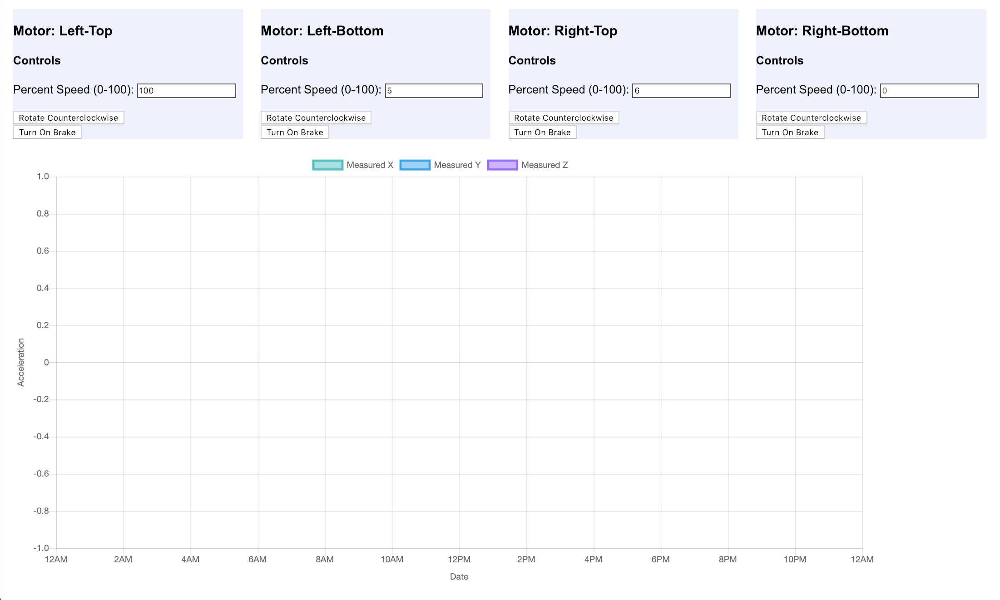

# project-daredevil-web
web interface for project daredevil to visualize acceleration measurements and control motors on the helmet.

Currently not hosted anywhere, but can be run locally.

1. `git clone https://github.com/quachtina96/project-daredevil-web.git`
2. `cd project-daredevil-web`
3. `npm start`

If you make any changes to the code in the `static` directory, you must run `npm run build`. This command will also automatically update the build folder as you make changes in the src directory, but not in the static directory.

